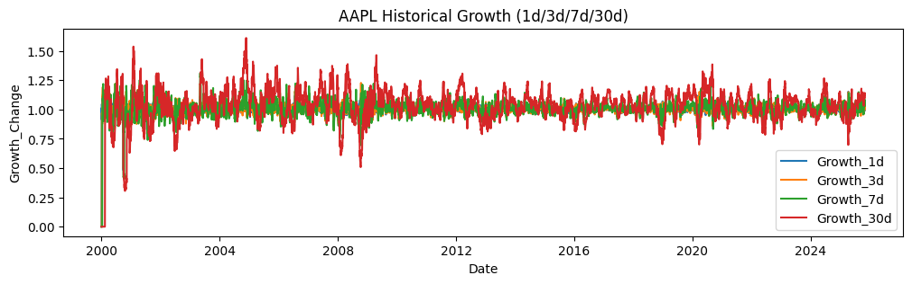
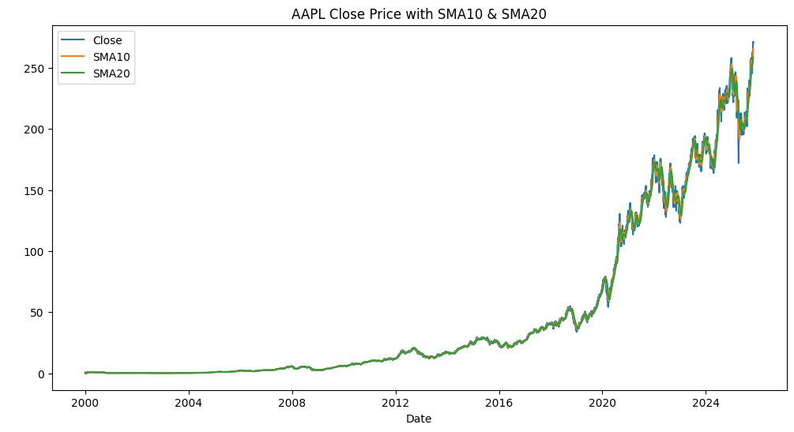
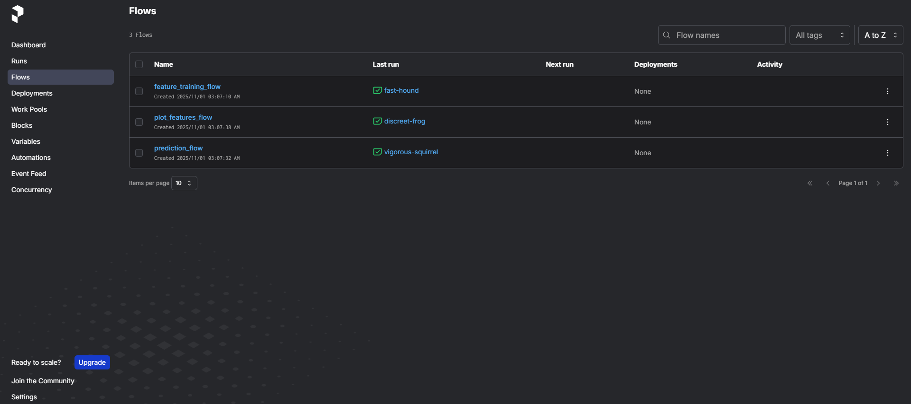
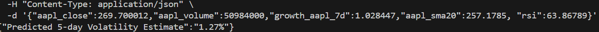

# 📊 Stock Prediction Pipeline

A modular **AI-driven financial prediction system** built with **Python**, **Prefect**, **XGBoost**, and **Flask**.  
It automates data extraction, feature engineering, model training, and prediction serving — all orchestrated with Prefect and containerized via Docker.
You can simply generate features by inputting the inquired Ticker e.g. AAPL, GOOGL, TSLA etc. It also covers crptocurrency ticker symbols
---

## 🚀 Key Features

✅ Automated financial data extraction (via Yahoo Finance)  
✅ Feature engineering (RSI, SMA10/20, volatility, historical growth)  
✅ Machine Learning models for:
- 5-day future growth classification
- Moving average crossover prediction
- Volatility regression  
✅ Prefect-based flow orchestration  
✅ REST API via Flask for serving real-time predictions  
✅ Full Docker support for local or cloud deployment  

---


---


## ⚙️ Installation Guide

### Clone the Repository
```bash
git clone https://github.com/yourusername/stock-prediction.git
cd stock-prediction
```

### Create Virtual Environment
```bash
python -m venv .venv
source .venv/bin/activate       
.venv\Scripts\activate          
```
### Install dependencies
```bash
pip install -r requirements.txt
```

Core Modules

`config.py`

* Default tracked tickers (AAPL, MSFT, GOOGL, etc.)

* Dynamic feature grouping via get_feature_keys(dfm)

`data_extraction.py`

* Stock data extraction with yfinance

* Feature creation: date, growth, SMA, RSI, volatility

* Cleansing infinite and NaN values

`preprocessing.py`

Implements Prefect Flows:

* full_features(ticker) – Creates complete dataset for a stock.

* feat(ticker) – Trains three models (growth, moving average, volatility).

* main(ticker) – Predicts future volatility using saved models.

* plot_features(ticker) – Plots SMA, RSI, and growth metrics.

* serve() – Registers flows with Prefect orchestration.

<br>

`Docker Deployment`
##### Build and Run Containers
```bash
docker-compose up --build
```
To stop all services
```bash
docker-compose down
```

<br>

`Command to explore features and generate images`

Using Ticker 'AAPL' as example. Kindly replace AAPL with any other ticker of your choice

```bash
python preprocessing.py --ticker AAPL --save-path dataset --mode feat && \
python preprocessing.py --ticker AAPL --save-path dataset --mode main && \
python preprocessing.py --ticker AAPL --save-path plot_images --mode plot_features
```









<br>

`Send JSOn to client`

```bash
curl -X POST http://localhost:8000/predict \
  -H "Content-Type: application/json" \
  -d '{"aapl_close":269.700012,"aapl_volume":50984000,"growth_aapl_7d":1.028447,"aapl_sma20":257.1785, "rsi":63.86789}'
```

That means the model expects AAPL’s price to fluctuate by about ±1.27% over the next 5 days, given its recent technical indicators.

<br>




`Future Consideration` 
Plan to Host in Prefect Cloud


For Pytest

```export PYTHONPATH=$PYTHONPATH:/src/predictions/config```


